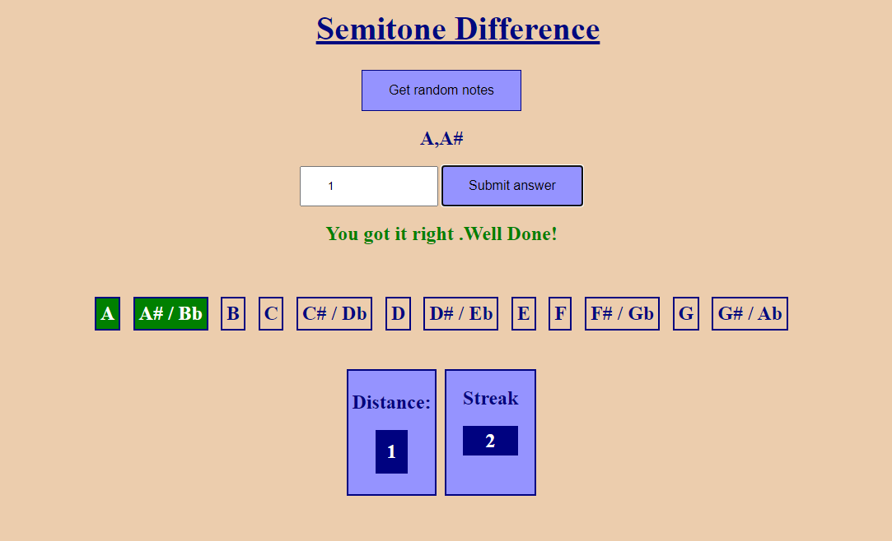

# Project Showcase: Semitone Difference

# How to install and run the project
- Install packages : `npm install`
- To build project : `npm run build`

## Overview

This project is a showcase of a simple JavaScript project that calculates the semitone difference between two notes. Allows the user to guess the semitone difference between two notes and provides feedback on the accuracy of the guess.

## Technologies Used

- **HTMl:** A popular JavaScript library for building user interfaces.
- **JavaScript** To embed and play project videos.
- **CSS:** Custom styling for the overall appearance.
- **Jasmine** For testing the project.
- **Webpack** For bundling and managing dependencies.

## Contact

For any inquiries or questions, feel free to reach out to Tshediso at [tshedisoboshiana@gmail.com](mailto:tshedisoboshiana@gmail.com).

Other projects can be found at [projects](https://projects-5584f.web.app/)

Happy exploring! 🚀
